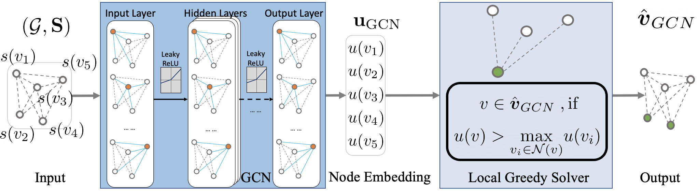
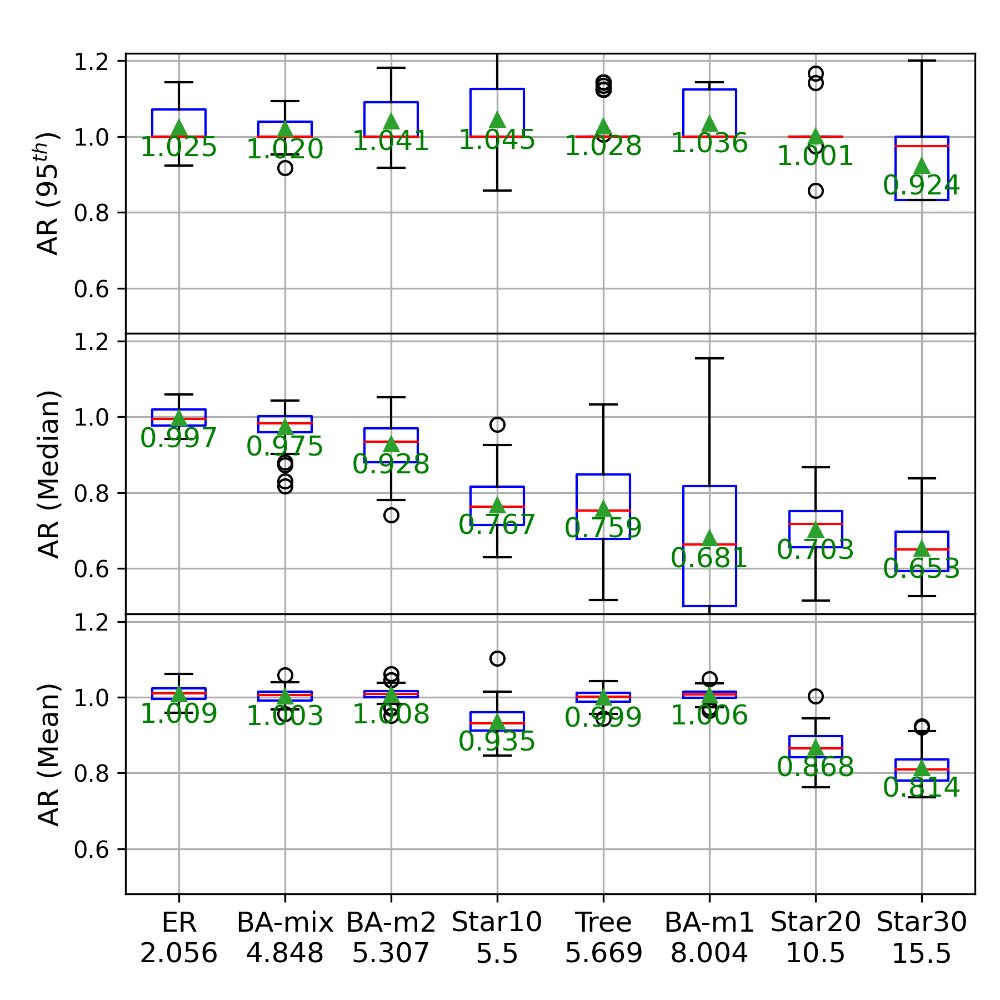

# Delay-Oriented Distributed Scheduling using Graph Neural Networks

Z. Zhao, G. Verma, A. Swami and S. Segarra, "Delay-Oriented Distributed Scheduling Using Graph Neural Networks," ICASSP 2022 - 2022 IEEE International Conference on Acoustics, Speech and Signal Processing (ICASSP), 2022, pp. 8902-8906, doi: 10.1109/ICASSP43922.2022.9746926.

arXiv <https://arxiv.org/abs/2111.07017>

```text
@INPROCEEDINGS{zhao2022delay,
  author={Zhao, Zhongyuan and Verma, Gunjan and Swami, Ananthram and Segarra, Santiago},
  booktitle={ICASSP 2022 - 2022 IEEE International Conference on Acoustics, Speech and Signal Processing (ICASSP)}, 
  title={Delay-Oriented Distributed Scheduling Using Graph Neural Networks}, 
  year={2022},
  volume={},
  number={},
  pages={8902-8906},
  doi={10.1109/ICASSP43922.2022.9746926}}
```


## Major finding

In delay-oriented scheduling in wireless multihop networks, the delay of a link (average queue length) depends on two factors, randomly arriving packets and the scheduling decision. We model this problem as a Markov Decision Process. A graph convolutional network (GCN) is trained to generate per-link utilities of a wireless multihop network, based on its network state. Based on the GCN-generated per-link utilities, a distributed Local Greedy Scheduler [Joo 2012] schedules the transmissions of links.  Since GCN can be naturally implemented in a distributed fashion, the execution of the entire process is fully distributed, which is very important for self-organizing networks. 



By taking in consideration of both interfering topology and link states, the proposed method can reduce congestion for wireless networks with high level of centralization  in the interference relationship (captured by a conflict graph), for example, when the wireless devices have very different transmit powers.



The level of centralization is indicated by the peak-to-average-ratio of node degree in a graph, number under the graph type in the boxplot.

## Try out the code
### Configuration
`pip3 install -r requirements.txt`

### Testing

Raw test results for the paper is in `./output/`

Plot figures `python3 plot_delay_oriented.py` 

Trained model in `./model/`

Run test code to replicate results on trained model

For Fig. 4

`bash ./bash/wireless_gcn_delay_test.sh`


For Fig. 5

`bash ./bash/wireless_gcn_delay_test_traffic_loads.sh`

### Training

`bash ./bash/wireless_gcn_delay_train.sh`

### Compute the levels of centralization of different graph models

Peak to average ratio of node degree in a graph

`bash ./bash/wireless_graph_centrality.sh`

checkout `wireless_degree_centrality.py`

